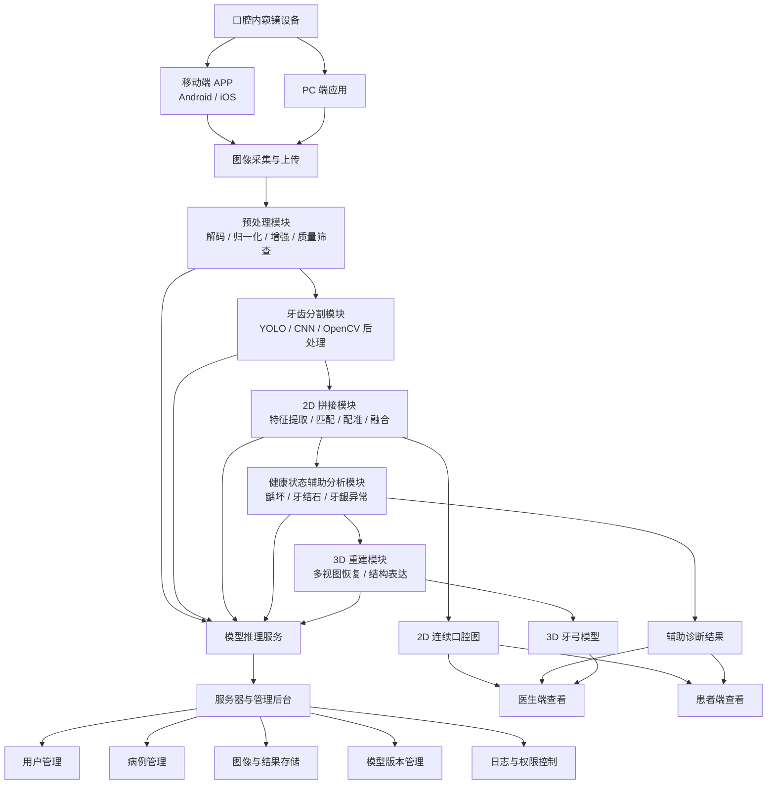
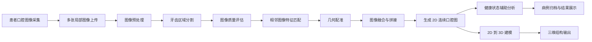
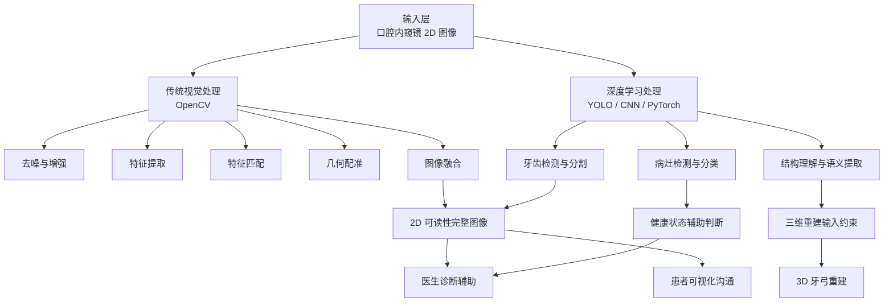
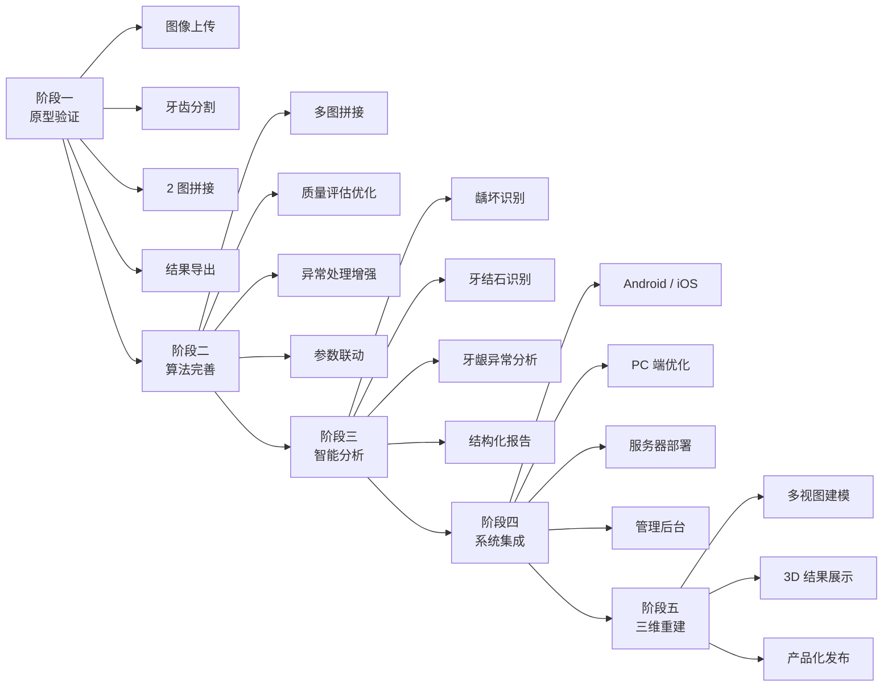
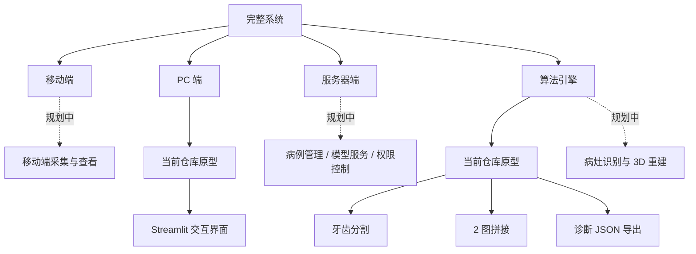

# 口腔内窥镜智能影像分析与三维重建系统 Mermaid 图

## 1. 系统总体架构图

```mermaid
flowchart TB
    A["口腔内窥镜设备"] --> B["移动端 APP<br/>Android / iOS"]
    A --> C["PC 端应用"]

    B --> D["图像采集与上传"]
    C --> D

    D --> E["预处理模块<br/>解码 / 归一化 / 增强 / 质量筛查"]
    E --> F["牙齿分割模块<br/>YOLO / CNN / OpenCV 后处理"]
    F --> G["2D 拼接模块<br/>特征提取 / 匹配 / 配准 / 融合"]
    G --> H["健康状态辅助分析模块<br/>龋坏 / 牙结石 / 牙龈异常"]
    H --> I["3D 重建模块<br/>多视图恢复 / 结构表达"]

    E --> J["模型推理服务"]
    F --> J
    G --> J
    H --> J
    I --> J

    J --> K["服务器与管理后台"]
    K --> K1["用户管理"]
    K --> K2["病例管理"]
    K --> K3["图像与结果存储"]
    K --> K4["模型版本管理"]
    K --> K5["日志与权限控制"]

    G --> L["2D 连续口腔图"]
    H --> M["辅助诊断结果"]
    I --> N["3D 牙弓模型"]

    L --> O["医生端查看"]
    M --> O
    N --> O

    L --> P["患者端查看"]
    M --> P
```

## 2. 数据流转图

```mermaid
flowchart LR
    A["患者口腔图像采集"] --> B["多张局部图像上传"]
    B --> C["图像预处理"]
    C --> D["牙齿区域分割"]
    D --> E["图像质量评估"]
    E --> F["相邻图像特征匹配"]
    F --> G["几何配准"]
    G --> H["图像融合与拼接"]
    H --> I["生成 2D 连续口腔图"]
    I --> J["健康状态辅助分析"]
    J --> K["病例归档与结果展示"]
    I --> L["2D 到 3D 建模"]
    L --> M["三维结构输出"]
```

## 3. 技术路线图

```mermaid
flowchart TD
    A["输入层<br/>口腔内窥镜 2D 图像"] --> B["传统视觉处理<br/>OpenCV"]
    A --> C["深度学习处理<br/>YOLO / CNN / PyTorch"]

    B --> B1["去噪与增强"]
    B --> B2["特征提取"]
    B --> B3["特征匹配"]
    B --> B4["几何配准"]
    B --> B5["图像融合"]

    C --> C1["牙齿检测与分割"]
    C --> C2["病灶检测与分类"]
    C --> C3["结构理解与语义提取"]

    B5 --> D["2D 可读性完整图像"]
    C1 --> D
    C2 --> E["健康状态辅助判断"]
    C3 --> F["三维重建输入约束"]

    D --> G["医生诊断辅助"]
    D --> H["患者可视化沟通"]
    E --> G
    F --> I["3D 牙弓重建"]
```

## 4. 分阶段实施路线图

```mermaid
flowchart LR
    A["阶段一<br/>原型验证"] --> A1["图像上传"]
    A --> A2["牙齿分割"]
    A --> A3["2 图拼接"]
    A --> A4["结果导出"]

    A --> B["阶段二<br/>算法完善"]
    B --> B1["多图拼接"]
    B --> B2["质量评估优化"]
    B --> B3["异常处理增强"]
    B --> B4["参数联动"]

    B --> C["阶段三<br/>智能分析"]
    C --> C1["龋坏识别"]
    C --> C2["牙结石识别"]
    C --> C3["牙龈异常分析"]
    C --> C4["结构化报告"]

    C --> D["阶段四<br/>系统集成"]
    D --> D1["Android / iOS"]
    D --> D2["PC 端优化"]
    D --> D3["服务器部署"]
    D --> D4["管理后台"]

    D --> E["阶段五<br/>三维重建"]
    E --> E1["多视图建模"]
    E --> E2["3D 结果展示"]
    E --> E3["产品化发布"]
```

## 5. 当前原型在整体系统中的位置

```mermaid
flowchart TB
    A["完整系统"] --> B["移动端"]
    A --> C["PC 端"]
    A --> D["服务器端"]
    A --> E["算法引擎"]

    C --> C1["当前仓库原型"]
    E --> E1["当前仓库原型"]

    C1 --> F["Streamlit 交互界面"]
    E1 --> G["牙齿分割"]
    E1 --> H["2 图拼接"]
    E1 --> I["诊断 JSON 导出"]

    D -. 规划中 .-> J["病例管理 / 模型服务 / 权限控制"]
    B -. 规划中 .-> K["移动端采集与查看"]
    E -. 规划中 .-> L["病灶识别与 3D 重建"]
```
